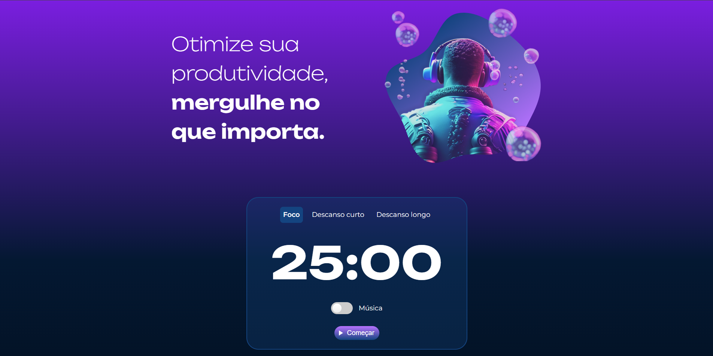

# Fokus ⏱️

Projeto desenvolvido durante cursos de **JavaScript da Alura**.

O **Fokus** é uma aplicação de temporizador inspirada na técnica **Pomodoro**, criada para ajudar na organização do tempo e no aumento da produtividade. A aplicação permite alternar entre períodos de foco, descanso curto e descanso longo, além de possibilitar o **gerenciamento de tarefas com persistência de dados no navegador**.

## 🚀 Funcionalidades

### ⏳ Temporizador Pomodoro

* Alternância entre:

  * **Modo foco**
  * **Descanso curto**
  * **Descanso longo**
* Contagem regressiva do tempo
* Botão para **iniciar e pausar o temporizador**
* Reprodução de **efeitos sonoros**
* Alteração dinâmica de **textos, imagens e estilos**

### ✅ Gerenciamento de tarefas

* Adicionar novas tarefas
* Editar tarefas existentes
* Selecionar tarefa ativa
* Marcar tarefa como **concluída automaticamente ao finalizar o foco**
* Remover tarefas concluídas
* Remover todas as tarefas
* Interface dinâmica criada via **manipulação do DOM**

### 💾 Persistência de dados

* Armazenamento das tarefas utilizando **LocalStorage**
* Recuperação automática das tarefas ao recarregar a página
* Manutenção do estado da aplicação entre sessões

## 🧠 Conceitos praticados

Durante o desenvolvimento foram aplicados diversos conceitos importantes de **JavaScript no front-end**, como:

* Seleção e manipulação de elementos no **DOM**
* Criação e gerenciamento de **eventos**
* Alteração dinâmica de **atributos, classes e conteúdo HTML**
* Controle de tempo com **setInterval** e **clearInterval**
* Criação dinâmica de elementos com **createElement**
* Manipulação de **arrays e objetos**
* Persistência de dados utilizando **LocalStorage**
* Gerenciamento de **estado da aplicação**
* Integração entre diferentes partes da interface

## 🛠️ Tecnologias utilizadas

* **HTML5**
* **CSS3**
* **JavaScript (Vanilla JS)**

## 📚 Cursos

Projeto desenvolvido durante os cursos da Alura:

* **JavaScript: manipulando elementos no DOM**
* **JavaScript: explorando a manipulação de elementos e da LocalStorage**

## 🎯 Objetivo

Praticar conceitos fundamentais de **JavaScript no front-end**, com foco em:

* manipulação do **DOM**
* criação de **interfaces interativas**
* gerenciamento de **estado da aplicação**
* persistência de dados no navegador
* desenvolvimento de funcionalidades reais para aplicações web

## 🌐 Deploy

Você pode acessar o projeto publicado em:

👉 https://jvtrfortunato.github.io/fokus/
👉 https://fokus-one-swart.vercel.app

## 📸 Preview

